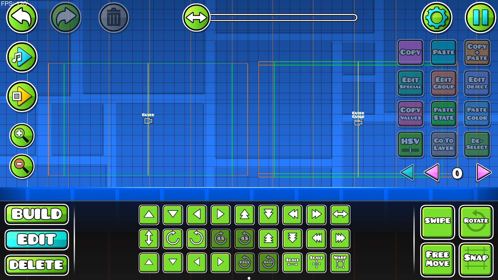

# The Plan

## Goals

First, we need to know what we actually want to achieve.
Here are some essential things we need to do:

- [x] Use a practical coordinate system
- [x] Dynamically calculate the size of a block based on the window size
- [x] Figure out how to make the objects
- [ ] Implement some physics
- [ ] Add textures
- [ ] Make the physics (almost) one to one compatible with Geometry Dash
- [ ] Achieve feature parity with GD 1.0
- [ ] Add some extra features
  - [ ] Built in hacks (maybe MegaHack-like?)
  - [ ] Inability to complete or make progress on levels when hacks have been activated
- [ ] Achieve feature parity with GD 1.1, 1.2, etc.

I will now provide some more details for some of the goals listed above.

### Use a practical coordinate system


The center of the yellow orb is at x=0 y=0. The horizontal white line is the ground.

For the coordinate system, we have 2 options:
1. Copy the GD coordinate system (1 block = 30 coordinate points).
   - This is easy to implement once we add more complicated stuff like importing levels from GD, because it's 1 to 1 compatible.
   - It introduces floating point errors, because the small arrow in the edit menu is 0.5 coordinate points.
2. 1 block = 60 coordinate points.
   - Can be integers, because the small arrow now moves something by 1 coordinate point.
   - It will be harder to implement importing levels from GD, we'll need to multiply everything by 2 and deal with cases where somehow the coordinate is not exactly aligned to 0.5 GD coordinate points

Because the floating point errors aren't really noticable except when really far from (0, 0), I've decided to go with option 1, the GD coordinate system.

### Dynamically calculate the size of a block

To know how big a block should be based on the window size, we first have to have some reference images.

The following reference images are from GD 2.1


With a 1920x1080 game, we can see that the screen is about 19x11 blocks.


With a 1280x768 game, we can see that the screen is about 18x11 blocks.


With a 800x600 game, we can see that the screen is about 16x12 blocks.

With this information, we can see that the height of the blocks is always about 1/11 of the screen.

But in 2.2 we have the Camera Guide trigger, with which we can see that the screen is always at least 320 coordinate points high and at least 480 coordinate points wide.
This does align with the 1/11 of the screen height per block, because a block is 30 coordinate points in size.


The Camera Guide trigger.

### Figure out how to make the objects

The objects are going to be stored as IDs, just like in GD.

We will have 2 structs, Object and ObjectDefenition:

```C
typedef struct {
    Coord position;
    // Any extra properties go here...
    int id;
} Object;
```

```C
typedef struct {
    ObjectType type;
    ObjectShape shape;
    Hitbox hitbox;
    Texture texture;
} ObjectDefenition;
```

We will then have a giant array of Object Defenitions that stores all the objects with their respective IDs.

I decided to go with this approach, because this was the best approach I could think of.
If anyone has a better approach, feel free to create a pull request.

### Implement some physics and try to make them compatible with GD

> BIG TODO

### Add textures

> ALSO TODO


<!-- This is for later maybe
## How are we going to make the objects?

We first have to think of what values are needed to define an object:

- Type (Solid/Static or Hazard or Decoration/Nonsolid)
- Hitbox (top left x & y, width, height)
- Texture
- Texture Size

And some things that are not neccesary, but are nice to have:

- Groups
- Editor Layer
- Z-Layer
- Z-Index
 -->
